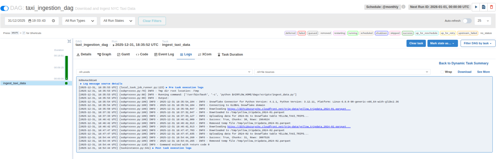
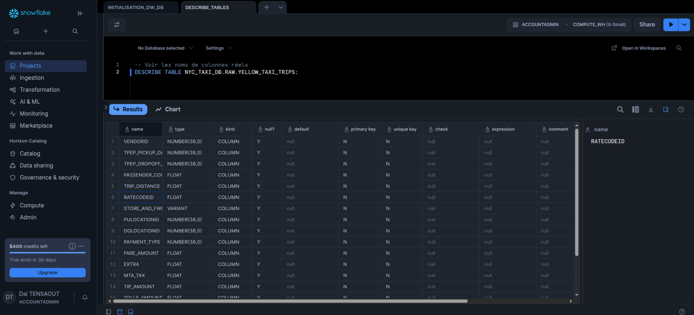
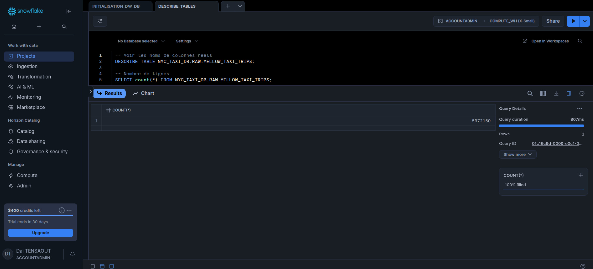
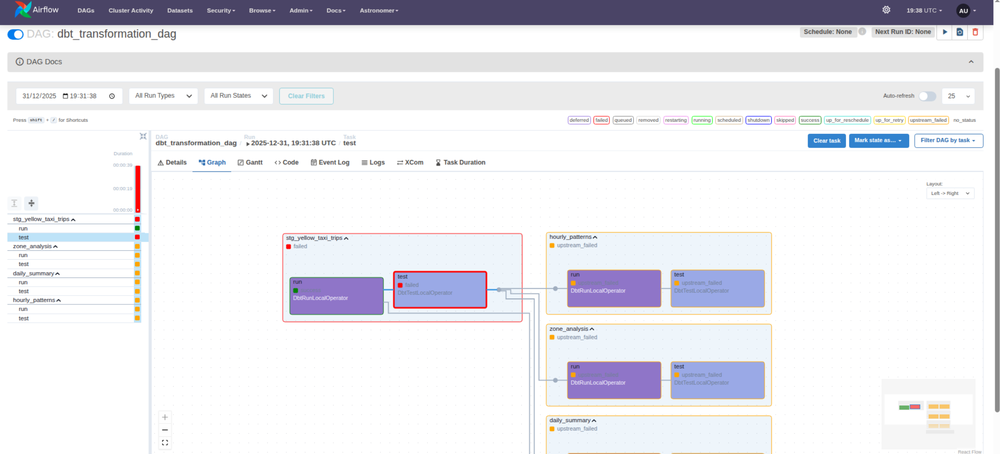
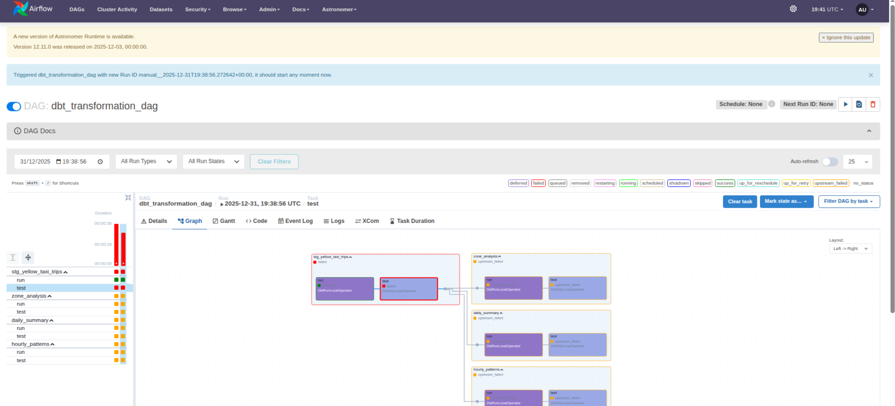
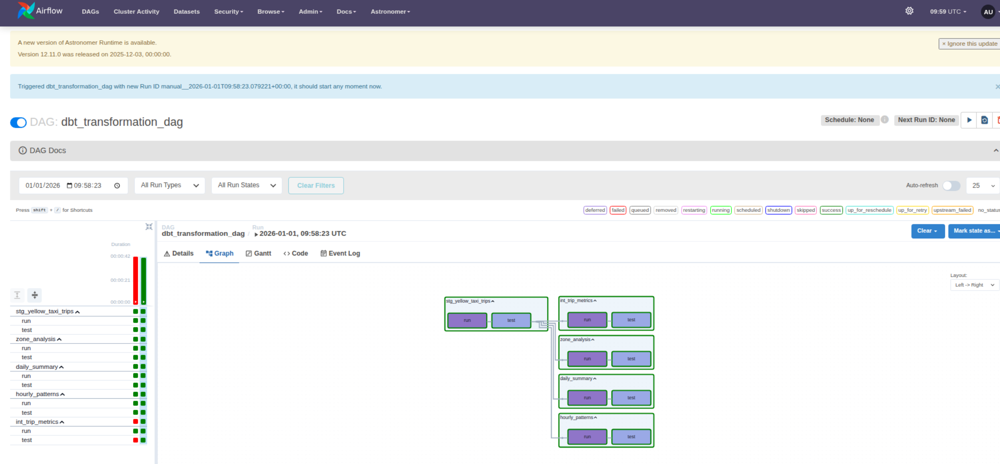
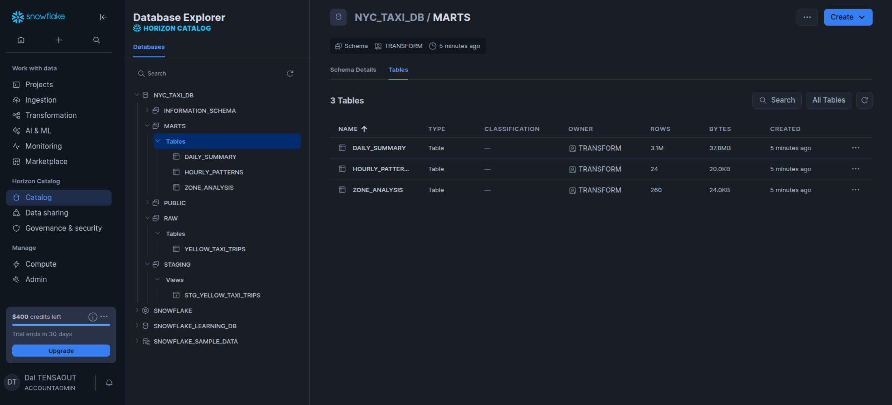

# NYC Taxi Data Pipeline
## Pipeline de Données Massives avec Snowflake, dbt et Airflow

---

## Vue d'ensemble

Ce projet implémente un pipeline de données complet pour analyser ~6 millions de trajets de taxis jaunes de NYC (janvier-février 2024). Il démontre les compétences en ingénierie de données moderne : ingestion automatisée, transformation avec dbt, orchestration avec Airflow, et tests de qualité.

### Dataset
- **Source** : [NYC Taxi & Limousine Commission](https://www.nyc.gov/site/tlc/about/tlc-trip-record-data.page)
- **Volume** : ~6 millions de trajets (2 mois de test)
- **Format** : Fichiers Parquet mensuels
- **Taille** : ~1.5 GB de données

---

## Architecture

```
Fichiers Parquet → RAW → STAGING → INTERMEDIATE → MARTS
                     ↓        ↓           ↓           ↓
              Données brutes → Nettoyage → Catégories → Analyses
```

### Schémas Snowflake
1. **RAW** : Données brutes importées (`YELLOW_TAXI_TRIPS`)
2. **STAGING** : Données nettoyées et enrichies (`stg_yellow_taxi_trips`)
3. **INTERMEDIATE** : Catégorisations business (`int_trip_metrics`)
4. **MARTS** : Tables analytiques finales
   - `daily_summary` : Métriques quotidiennes
   - `zone_analysis` : Analyses par zone
   - `hourly_patterns` : Patterns horaires

---

## Installation et Configuration

### Prérequis
- Python 3.12+
- Docker & Docker Compose
- Compte Snowflake
- Astro CLI (pour Airflow)

### 1. Configuration Snowflake

Exécutez le script SQL d'initialisation dans Snowflake :
```sql
-- Voir snowflake/workspace/EXEMPLE_INITIALISATION_WH_DB.sql
-- Crée : Warehouse, Database, Schemas, User, Permissions
```

### 2. Configuration Airflow

Copiez et configurez les fichiers d'environnement :
```bash
cd dbt-dag
cp airflow_settings.yml.exemple airflow_settings.yaml
cp .env.exemple .env
```

Éditez `.env` avec vos credentials Snowflake :
```bash
SF_ACCOUNT=votre-compte
SF_USER=dbt_taxi
SF_PASSWORD=votre-mot-de-passe
SF_ROLE=TRANSFORM
SF_WAREHOUSE=NYC_TAXI_WH
SF_DATABASE=NYC_TAXI_DB
SF_SCHEMA=RAW
```

### 3. Démarrage d'Airflow

```bash
cd dbt-dag
astro dev start
```

Accédez à l'interface : `http://localhost:8080` (admin/admin)

---

## Exécution du Pipeline

### Étape 1 : Ingestion des Données

1. Dans Airflow, activez le DAG `taxi_ingestion_dag`
2. Déclenchez-le manuellement (bouton Play)
3. **Durée estimée** : 10-20 minutes
4. **Résultat** : Table `RAW.YELLOW_TAXI_TRIPS` créée avec ~6M lignes

**Vérification dans Snowflake** :
```sql
SELECT COUNT(*) FROM NYC_TAXI_DB.RAW.YELLOW_TAXI_TRIPS;
-- Devrait retourner ~5-6 millions
```

**Preuve d'exécution** :


*DAG d'ingestion exécuté avec succès dans Airflow*


*Vérification du nombre de lignes chargées dans Snowflake (~5.8M)*


*Aperçu des données brutes dans la table RAW.YELLOW_TAXI_TRIPS*

### Étape 2 : Transformation dbt

1. Dans Airflow, activez le DAG `dbt_transformation_dag`
2. Déclenchez-le manuellement
3. **Durée estimée** : 5-10 minutes
4. **Résultat** : 
   - Vue `STAGING.stg_yellow_taxi_trips`
   - Vue `INTERMEDIATE.int_trip_metrics`
   - Tables `MARTS.*` (daily_summary, zone_analysis, hourly_patterns)

**Vérification dans Snowflake** :
```sql
-- Données nettoyées
SELECT * FROM NYC_TAXI_DB.STAGING.stg_yellow_taxi_trips LIMIT 10;

-- Résumés quotidiens
SELECT * FROM NYC_TAXI_DB.MARTS.daily_summary ORDER BY date DESC LIMIT 10;

-- Top 10 zones
SELECT * FROM NYC_TAXI_DB.MARTS.zone_analysis ORDER BY trip_count DESC LIMIT 10;

-- Patterns horaires
SELECT * FROM NYC_TAXI_DB.MARTS.hourly_patterns ORDER BY pickup_hour;
```

**Preuve d'exécution** :


*DAG de transformation dbt en cours d'exécution*


*DAG de transformation dbt terminé avec succès*


*15 tests de qualité dbt passés avec succès*


*Tables finales créées dans le schéma MARTS de Snowflake*

---

## Tests de Qualité

Le pipeline inclut **15 tests dbt automatiques** :
- Tests de non-nullité sur colonnes essentielles
- Tests de plages de valeurs (distances 0.1-100 miles, vitesse 0-100 mph)
- Tests de cohérence des montants (>= 0)
- Tests de catégorisations (distance, période, jour)

**Exécution manuelle** :
```bash
cd dbt-dag/dags/dbt/taxi_nyc_pipeline
dbt test
```

---

## Transformations Implémentées

### Nettoyage des Données (Staging)
- Filtrage des montants négatifs
- Exclusion des trajets avec dates incohérentes
- Suppression des distances aberrantes (< 0.1 ou > 100 miles)
- Gestion des valeurs manquantes

### Enrichissements (Staging)
- Durée du trajet (minutes)
- Vitesse moyenne (mph)
- Pourcentage de pourboire
- Dimensions temporelles (heure, jour, mois, année, nom du jour)

### Catégorisations Business (Intermediate)
- **Distances** : Courts (≤1 mile), Moyens (1-5), Longs (5-10), Très longs (>10)
- **Périodes** : Rush Matinal (6h-9h), Journée (10h-15h), Rush Soir (16h-19h), Soirée (20h-23h), Nuit (0h-5h)
- **Types de jours** : Semaine vs Weekend

---

## Livrables

### Tronc Commun
1. **Architecture Snowflake** : 4 schémas (RAW, STAGING, INTERMEDIATE, MARTS)
2. **Scripts dbt** : 5 modèles SQL documentés
3. **Documentation** : Ce README avec instructions complètes
4. **Analyse** : Tests de qualité intégrés (15 tests)

### Options Avancées
5. **Script Python** : `ingest_data.py` - Automatisation du chargement
6. **Orchestration Airflow** : 2 DAGs (ingestion + transformation)
7. **dbt Core** : Modèles avec tests et documentation
   - 1 modèle staging
   - 1 modèle intermediate
   - 3 modèles marts

---

## Structure du Projet

```
Taxi_NYC_Analyse/
├── dbt-dag/                          # Projet Airflow (Astro)
│   ├── dags/
│   │   ├── scripts/
│   │   │   └── ingest_data.py        # Script d'ingestion Python
│   │   ├── ingestion_dag.py          # DAG Airflow ingestion
│   │   ├── dbt_dag.py                # DAG Airflow dbt
│   │   └── dbt/taxi_nyc_pipeline/    # Projet dbt
│   │       ├── models/
│   │       │   ├── staging/          # Modèles de nettoyage
│   │       │   ├── intermediate/     # Catégorisations
│   │       │   └── marts/            # Tables finales
│   │       └── dbt_project.yml
│   ├── .env                          # Credentials Snowflake
│   └── airflow_settings.yaml         # Config Airflow
├── snowflake/
│   └── workspace/
│       └── INITIALISATION_WH_DB.sql  # Script setup Snowflake
└── README.md                         # Cette documentation
```

---

## KPIs Calculés

Les tables MARTS permettent d'analyser :
- **Volume** : Nombre de trajets par jour/heure/zone
- **Revenus** : Revenus totaux et moyens
- **Performance** : Distance moyenne, vitesse moyenne, durée moyenne
- **Comportement** : Pourcentage de pourboire, patterns horaires
- **Géographie** : Top zones de départ, zones les plus lucratives

---

## Documentation dbt

La documentation interactive des modèles dbt est disponible en ligne :
**[Documentation dbt](https://DaiTensa.github.io/brief_dbt_airflow_snowflake/)**

Cette documentation inclut :
- Lignage des données (graphe de dépendances)
- Description de chaque modèle et colonne
- Liste des tests de qualité
- Code SQL source
- Métadonnées complètes depuis Snowflake

### Générer la documentation localement

Pour générer et déployer la documentation dbt manuellement :

#### 1. Générer la documentation depuis le conteneur Airflow

```bash
# Générer la documentation avec connexion Snowflake
docker exec $(docker ps -q -f name=scheduler) /bin/bash -c \
  "cd /usr/local/airflow/dags/dbt/taxi_nyc_pipeline && \
   /usr/local/airflow/dbt_venv/bin/dbt docs generate"
```

#### 2. Copier les fichiers vers le dossier docs/

```bash
cd /home/dai/Documents/Python_Projects/Taxi_NYC_Analyse

docker cp $(docker ps -q -f name=scheduler):/usr/local/airflow/dags/dbt/taxi_nyc_pipeline/target/index.html docs/
docker cp $(docker ps -q -f name=scheduler):/usr/local/airflow/dags/dbt/taxi_nyc_pipeline/target/manifest.json docs/
docker cp $(docker ps -q -f name=scheduler):/usr/local/airflow/dags/dbt/taxi_nyc_pipeline/target/catalog.json docs/
docker cp $(docker ps -q -f name=scheduler):/usr/local/airflow/dags/dbt/taxi_nyc_pipeline/target/graph.gpickle docs/
```

#### 3. Déployer sur GitHub Pages

```bash
git add docs/
git commit -m "Update dbt documentation"
git push origin main
```

La documentation sera automatiquement déployée sur GitHub Pages en 1-2 minutes.

### Configuration GitHub Pages (première fois uniquement)

1. Allez dans **Settings** → **Pages** de votre repository
2. **Source** : Deploy from a branch
3. **Branch** : `main`
4. **Folder** : `/docs`
5. Cliquez sur **Save**

### Configuration optionnelle : Workflow automatique

Pour automatiser la génération de documentation à chaque push, configurez les secrets GitHub :

1. Allez dans **Settings** → **Secrets and variables** → **Actions**
2. Ajoutez les secrets suivants :
   - `SNOWFLAKE_ACCOUNT` : Votre identifiant de compte Snowflake
   - `SNOWFLAKE_USER` : `dbt_taxi`
   - `SNOWFLAKE_PASSWORD` : Mot de passe de l'utilisateur dbt_taxi
   - `SNOWFLAKE_ROLE` : `TRANSFORM`
   - `SNOWFLAKE_WAREHOUSE` : `NYC_TAXI_WH`
   - `SNOWFLAKE_DATABASE` : `NYC_TAXI_DB`

Le workflow `.github/workflows/deploy-dbt-docs.yml` se déclenchera automatiquement à chaque modification des modèles dbt.

---

## Technologies Utilisées

- **Snowflake** : Data Warehouse cloud
- **dbt Core** : Transformation de données (ELT)
- **Apache Airflow** : Orchestration (Astronomer Cosmos)
- **Python** : Scripts d'ingestion (pandas, snowflake-connector)
- **Docker** : Conteneurisation Airflow
- **Git** : Versioning

---

## Auteur

Projet réalisé dans le cadre de la formation Data Engineering - Simplon

---

## Notes

- Les données de test couvrent janvier-février 2024 (~6M trajets)
- Pour charger l'année complète, modifier `ingest_data.py` ligne 53
- Les tests dbt s'exécutent automatiquement à chaque run
- La documentation dbt peut être générée avec `dbt docs generate`